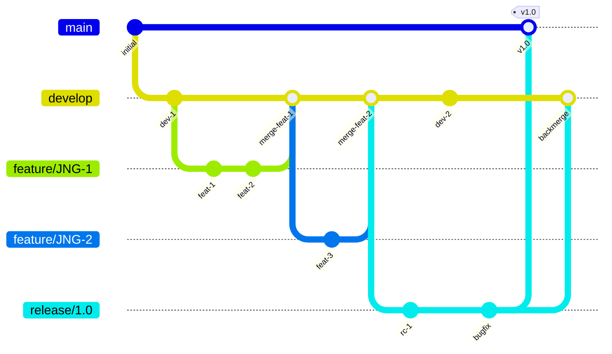
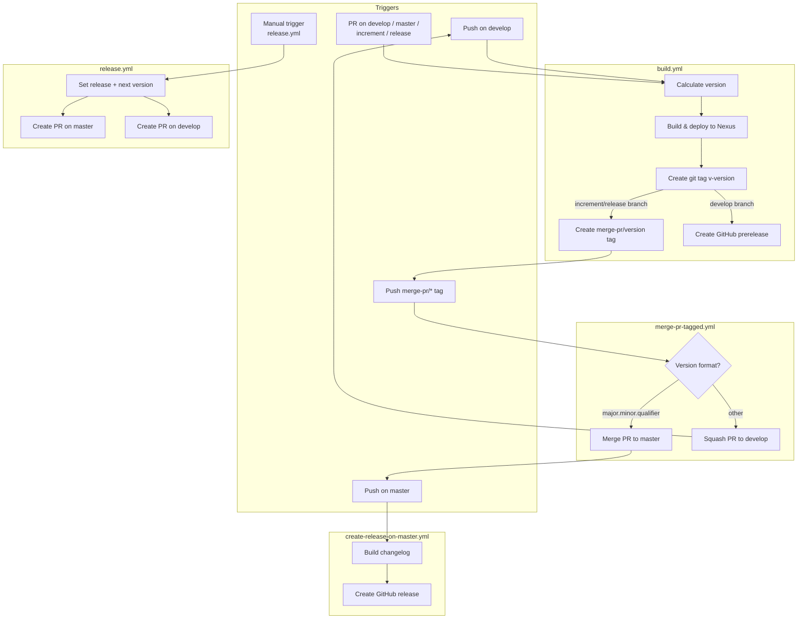

# Development Version and Branch Handling

This document describes the branching strategy, version numbering, and CI/CD pipeline for the osgi-encryption project. The workflow is based on GitFlow, automated through GitHub Actions.

## Branches

The branching model determines how code moves from development through testing to release. Each branch type serves a specific role in the lifecycle.

| Branch pattern | Purpose | Based on |
|---------------|---------|----------|
| `develop` | Latest development sources of the active version | — |
| `feature/JNG-xxxx_short_summary` | New features for the next release | `develop` |
| `release/x.y.z` or `x_y_betaN` | Stabilization branch for a specific release | `develop` |
| `bugfix/JNG-xxxx_short_summary` | Fixes applied during release testing | release branch |
| `support/JNG-xxxx_short_summary` | Minor changes backported to a previous release | release branch |
| `hotfix/JNG-xxxx_short_summary` | Critical fixes applied to both master and release | `master` |
| `master` | Latest released (stable) sources | — |

## Version Numbers

Versions follow semantic versioning with these rules:

| Event | Version change | Example |
|-------|---------------|---------|
| Start a feature branch | No change | stays `1.1.0-SNAPSHOT` |
| Start a release branch | Bump 2nd number on `develop` | `1.1.0` → `1.2.0-SNAPSHOT` |
| Bugfix on release branch | No change | stays at release version |
| Start a support branch | Bump 3rd number | `1.0.0` → `1.0.1` |
| Start a hotfix branch | Bump 4th number | `1.0.0` → `1.0.0.1` |

The current version is managed via the `${revision}` Maven property (`1.1.0-SNAPSHOT`) with the `flatten-maven-plugin` resolving it during CI builds.

## GitHub Actions Workflows

The CI/CD pipeline consists of several interconnected GitHub Actions workflows. Here is how they interact:

### build.yml — Main Build Pipeline

**Triggered by:** push on `develop`, PRs on `develop`/`master`/`increment/*`/`release/*`, or manual dispatch.

The build pipeline works as follows:

1. **Version calculation** — On `master`/`release/*` branches, the version comes directly from `pom.xml` (without `-SNAPSHOT`). On `develop`/feature branches, a timestamp and commit ID are appended: `major.minor.patch.YYYYMMdd_HHmmss_commitId_branch`.
2. **Build and deploy** — Runs `mvn` with artifact signing, deploys to the JUDO Nexus repository.
3. **Tagging** — Creates a git tag `v<version>`.
4. **Merge tag** — For `increment/*` and `release/*` branches, creates a `merge-pr/<version>` tag to trigger the merge workflow.
5. **Prerelease** — For `develop` builds, generates a changelog and creates a GitHub prerelease.

### merge-pr-tagged.yml — PR Merge Automation

**Triggered by:** push of a `merge-pr/*` tag (created by build.yml).

Routes the merge based on version format:
- **`major.minor.qualifier`** format → merges the PR to `master`, which triggers `create-release-on-master.yml`
- **Other formats** → squashes the PR to `develop`, which triggers another `build.yml` run

After merging, the `merge-pr/*` tag is deleted.

### release.yml — Release Initiation

**Triggered by:** manual dispatch with a version parameter (`'auto'` or explicit `major.minor.qualifier`).

Creates two pull requests:
1. PR on `master` with the release version
2. PR on `develop` with the next incremented version

Both PRs trigger `build.yml` for validation.

### create-release-on-master.yml — Release Publication

**Triggered by:** push on `master`.

Builds a changelog from commit history and creates a GitHub release (marked as latest).

## Development Rules

> **Important:** There is no commit without a ticket number. Every commit and PR must include a JIRA ticket reference in `JNG-xxxx` format.

For issue tracking, the project uses [JIRA](https://blackbelt.atlassian.net/jira/dashboards).
