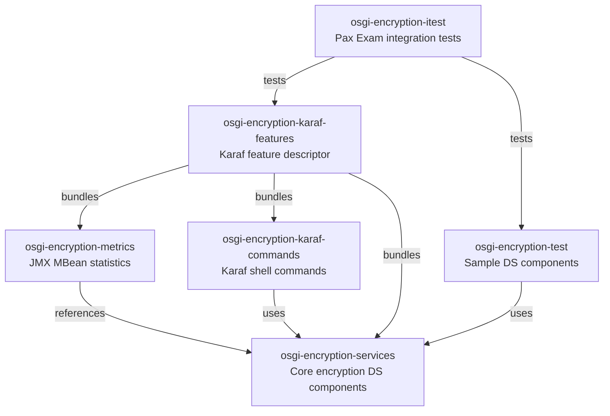

# Contributing to OSGi Encryption

This guide covers how to set up your development environment, understand the project structure, and submit changes to the osgi-encryption project.

## Development Environment

Make sure your environment meets these requirements before starting:

- **Java 21 JDK** (builds with Java 21, targets Java 11 bytecode)
- **Maven 3.9.4+** (or use the included `./mvnw` wrapper)
- A Maven `settings.xml` with access to the JUDO Nexus repository if you need snapshot dependencies

For full environment setup details, see the parent project's [CONTRIBUTING guide](https://github.com/BlackBeltTechnology/judo-community/blob/develop/CONTRIBUTING.adoc).

## Project Structure

The project is a multi-module Maven reactor that wraps [Jasypt](http://www.jasypt.org) encryption as OSGi Declarative Services components.



## Build Commands

```sh
# Full build (compile, test, package, install to local repo)
mvn clean install

# Run unit tests only
mvn clean test

# Run a single test class
mvn -pl osgi-encryption-services -Dtest=StringEncryptorTest test

# Run integration tests (launches Karaf via Pax Exam)
mvn -pl osgi-encryption-itest verify

# Build with code coverage report
mvn clean install jacoco:report
```

> **Note:** Integration tests in `osgi-encryption-itest` launch a full Apache Karaf container and have a 30-minute Surefire timeout.

## Submitting an Issue

Before opening a new issue, search the [issue tracker](https://github.com/BlackBeltTechnology/osgi-encryption/issues) to check if your problem has already been reported.

When filing a bug, include:

| What to include | Why it helps |
|----------------|-------------|
| Output of `java -version` and `mvn -version` | Confirms your toolchain matches expectations |
| Relevant `pom.xml` or `.flattened-pom.xml` | Shows dependency versions |
| A minimal reproducing use case | Lets maintainers confirm and isolate the bug quickly |

File new issues using the [issue form](https://github.com/BlackBeltTechnology/osgi-encryption/issues/new/choose).

## Submitting a Pull Request

This project uses [GitHub's standard forking model](https://guides.github.com/activities/forking/):

1. Fork the repository
2. Create a feature branch from `develop` (e.g., `feature/JNG-1234_short_description`)
3. Make your changes and ensure all tests pass
4. Submit a pull request targeting `develop`

> **Important:** Every commit and PR must reference a JIRA ticket number in `JNG-xxxx` format. Commits without ticket numbers will be rejected.

## Code Conventions

- **Java 11** language level (source and target)
- **Lombok** is used for reducing boilerplate — make sure your IDE has Lombok support enabled
- **Apache License 2.0** headers are required on all source files
- OSGi components use **Declarative Services 1.3** annotations (`@Component`, `@Reference`, `@Activate`, etc.)
- OSGi bundles are packaged with the **Apache Felix Maven Bundle Plugin**
